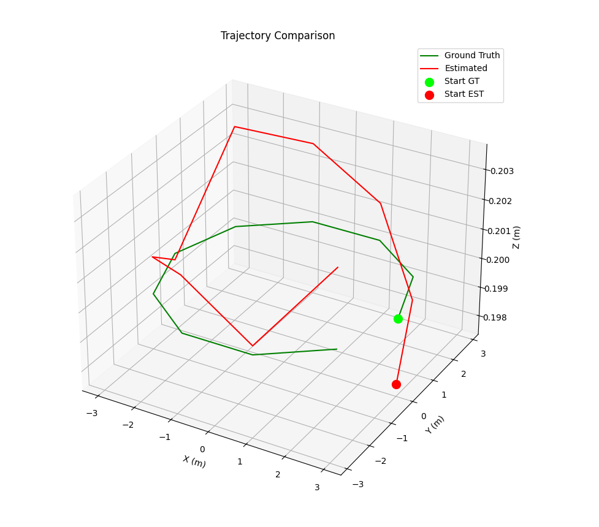

# VIO-from-Datasets

This repository provides a minimal, laptop-runnable implementation of a Visual-Inertial Odometry (VIO) pipeline starter. It begins with a synthetic "cube scene" dataset and a Perspective-n-Point (PnP)-based pose estimation algorithm. The project is designed to be a learning tool and a foundation for building a more complete Visual Odometry (VO) or VIO system.

The initial demo generates a synthetic 3D point cloud, simulates camera motion, projects the 3D points into 2D image coordinates, and then uses PnP with RANSAC to recover the camera poses. It concludes by evaluating the estimated trajectory against the ground truth using Absolute Trajectory Error (ATE) and Relative Pose Error (RPE).

## Prerequisites

Before you begin, ensure you have the following installed on your system.

### Windows

- **Python 3.10–3.12**: Download a compatible version from the [official Python website](https://www.python.org/downloads/). Make sure to check "Add Python to PATH" during installation.
- **Git**: Download and install from [git-scm.com](https://git-scm.com/download/win).

### macOS

- **Homebrew**: If you don't have it, install it by running the command on the [Homebrew website](https://brew.sh/).
- **Python 3.10–3.12** and **Git**: Install using Homebrew:
  ```bash
  brew install python@3.12 git
  ```
  **Note:** You may need to follow Homebrew's instructions to ensure `python@3.12` is in your `PATH`.

## Getting Started

Follow these steps to set up the project locally.

1.  **Clone the repository:**
    ```bash
    git clone https://github.com/your-username/vio-from-datasets.git
    cd vio-from-datasets
    ```

2.  **Create and activate a virtual environment (Python 3.12 recommended):**

    If you have multiple Python versions installed, you need to specify the path to the `python3.12` executable.

    - **Windows (PowerShell):**
      First, find your Python 3.12 path. It's often in `C:\Users\YourUser\AppData\Local\Programs\Python\Python312\python.exe`. You can also use `py -0p` to list installed Pythons.
      ```powershell
      # Replace with your actual path to python.exe
      py -3.12 -m venv .venv 
      .\.venv\Scripts\Activate.ps1
      ```
      *If you get an error about running scripts, you may need to set the execution policy: `Set-ExecutionPolicy -ExecutionPolicy RemoteSigned -Scope Process`*

    - **macOS / Linux:**
      ```bash
      python3.12 -m venv .venv
      source .venv/bin/activate
      ```

3.  **Install dependencies:**
    ```bash
    pip install -r requirements.txt
    ```

## Running the Synthetic Data Demo

Once the setup is complete, you can run the main demo:

```bash
python -m demos.run_synthetic --n-points 200 --cube-size 0.5 --n-poses 10 --radius 3.0 --height 0.2 --noise-px 0.8 --save-plot outputs/run.png
```

Or, after installing the package (editable or via pip), use the CLI entrypoint:

```bash
vio-demo --no-show --save-plot outputs/run.png
```

This script will perform the following actions:
- Generate a synthetic "cube scene" with 3D landmarks.
- Create a sequence of 10 camera poses moving around the scene.
- For each pose, it will:
    - Project the 3D points onto the 2D image plane.
    - Use OpenCV's PnP solver (with RANSAC) to estimate the camera's pose from the 2D-3D correspondences.
- After processing the sequence, it will:
    - Display a 3D plot comparing the ground truth camera trajectory with the estimated trajectory.
    - Print the ATE and RPE metrics to the console, which quantify the accuracy of the pose estimation.

Example output:
```
ATE (m, RMS): 0.0021
RPE (m, RMS @ delta=1): 0.0007
```
Example plot output:




## Project Structure

The repository is organized as follows:

```
.
├── demos/              # Runnable demo scripts
│   └── run_synthetic.py
├── tools/              # Utilities (e.g., benchmarking)
│   └── benchmark.py
├── vio/                # Core VIO/VO library code
│   ├── camera.py       # Pinhole camera model
│   ├── evaluate.py     # Trajectory evaluation metrics (ATE, RPE)
│   ├── geometry.py     # Geometric transformations and utilities
│   ├── io.py           # Data I/O, synthetic scene generation
│   └── pnp_demo.py     # PnP-based pose estimation logic
│   └── datasets/       # Dataset loader scaffolds (EuRoC, TUM-VI)
│       ├── base.py
│       ├── euroc.py
│       └── tum_vi.py
├── tests/              # Basic tests
│   └── test_basic.py
├── .github/workflows/ci.yml  # CI pipeline
├── Makefile            # Common tasks
├── README.md
└── requirements.txt
```

## From Simulation to the Real World

The core of this project—estimating a camera's pose from 3D points—is a fundamental building block for technologies that need to understand their position in the physical world. This is the first step in creating a full Visual-Inertial Odometry (VIO) or SLAM (Simultaneous Localization and Mapping) system.

Real-world applications of this technology include:
- **Augmented Reality (AR):** For devices like the HoloLens or smartphones to overlay virtual objects onto your view of the real world.
- **Robotics and Drones:** To enable navigation in GPS-denied environments like warehouses, tunnels, or even on other planets.
- **Virtual Reality (VR):** For "inside-out" tracking on standalone headsets like the Meta Quest, allowing users to move in the real world and have that motion reflected in VR.

## A Sandbox for Research and Experimentation

This repository is designed to be a simple, accessible sandbox for learning, research, and experimentation.

- **Low Barrier to Entry:** The synthetic dataset removes the need for hardware or complex calibration. Anyone can clone the repo and immediately start working with the core algorithms.
- **Verifiable Results:** Since we have the ground truth for the simulation, you can get immediate feedback on your changes. The ATE and RPE metrics will tell you if your modifications improve the results.
- **Focused Experimentation:** The modular structure allows you to test new ideas in isolation. For example:
    - **Test a new outlier rejection scheme:** Modify `vio/pnp_demo.py` to try a different RANSAC configuration or even a different robust estimation algorithm. You can adjust the `noise_px` parameter in `demos/run_synthetic.py` to see how your algorithm performs under different levels of noise.
    - **Experiment with different camera trajectories:** Modify `vio/io.py` to generate more complex camera motions (e.g., adding loops or more aggressive rotations) and see how the PnP algorithm holds up.
    - **Simulate different scene structures:** Change `generate_cube_scene` to create a planar scene or a random cloud of points and analyze how the feature distribution affects performance.

This project provides a ready-made scaffold for testing new theories in 3D computer vision without the overhead of building a complex system from the ground up. It now also includes:

- **Configurable CLI** for `demos/run_synthetic.py`
- **Structured logging** with `vio.logging_utils`
- **Safer numerics** and input validation throughout
- **Optional plot saving** via `plot_traj(..., save_path=...)`
- **Basic tests** under `tests/` to sanity-check core functionality
- **Benchmarking** via `tools/benchmark.py` and `make bench`
- **CI** via GitHub Actions under `.github/workflows/ci.yml`
- **Dataset scaffolds** at `vio/datasets/` to later plug in EuRoC/TUM-VI

## API Overview

- `vio.PinholeCamera`: Pinhole camera intrinsics with validation and undistortion.
- `vio.io.generate_cube_scene(n_points, cube_size, seed) -> np.ndarray`: Synthetic 3D points.
- `vio.io.generate_camera_poses(n_poses, radius, height) -> List[np.ndarray]`: Circular camera poses.
- `vio.pnp_demo.run_pnp_sequence(pts3d, cam, gt_Ts, noise_px, seed, ...) -> List[np.ndarray]`: PnP sequence.
- `vio.evaluate.trajectory_ATE(gt_Ts, est_Ts) -> float`: Absolute Trajectory Error.
- `vio.evaluate.trajectory_RPE(gt_Ts, est_Ts, delta) -> float`: Relative Pose Error.
- `vio.evaluate.plot_traj(gt_Ts, est_Ts, show=True, save_path=None) -> (Figure, Axes)`: 3D plot utility.

## Makefile Shortcuts

- `make setup`: install deps, pytest, pre-commit
- `make dev`: editable install with console script `vio-demo`
- `make test`: run tests
- `make demo`: run the synthetic demo and save a plot
- `make bench`: run small runtime/accuracy benchmarks

## How to Contribute

Contributions are welcome! This project is a great place to learn about and experiment with SLAM and VIO concepts.

### Future Work

Here are some ideas for extending the project:
- **KLT Feature Tracking:** Implement a Kanade-Lucas-Tomasi (KLT) tracker to create 2D feature tracks across multiple frames instead of using pre-rendered projections.
- **Two-View Triangulation:** Replace the known 3D landmark points with points triangulated from two keyframes using the essential matrix.
- **EKF with IMU Preintegration:** Implement an Extended Kalman Filter (EKF) and add an IMU preintegration module for full VIO.
- **Dataset Support:** Add data loaders for standard VIO datasets like [EuRoC](https://projects.asl.ethz.ch/datasets/doku.php?id=kmavvisualinertialdatasets) and [TUM-VI](https://vision.in.tum.de/data/datasets/visual-inertial-dataset).

If you'd like to work on one of these, please open an issue to discuss your approach.

## License

This project is licensed under the MIT License. See the `LICENSE` file for details.
